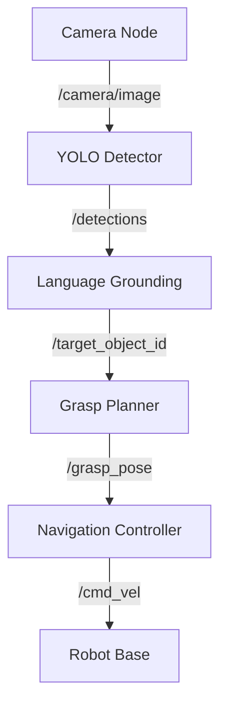

# Capstone Project: Requirements & Evaluation Rubric

## Overview

This document specifies the **technical requirements** and **evaluation criteria** for the capstone project. Your submission will be graded on integration completeness, system robustness, code quality, demonstration, and reflection.

**Total Points:** 100

---

## Part 1: Integration Completeness (40 points)

Your project must **meaningfully integrate all four modules**. Each module contributes specific functionality to the end-to-end system.

### Module 1: ROS 2 Communication (10 points)

**Requirements:**
- [ ] Custom ROS 2 workspace with at least **3 packages**
- [ ] At least **2 custom nodes** (not just launching existing packages)
- [ ] Use of **topics, services, AND actions** (all three communication paradigms)
- [ ] Launch file that starts all nodes with proper dependencies
- [ ] Parameter server for configuration (at least 3 parameters)

**Grading Rubric:**

| Points | Criteria |
|--------|----------|
| 10 | All requirements met; clean node architecture; proper use of ROS 2 best practices |
| 7-9 | Most requirements met; minor issues with communication patterns or launch files |
| 4-6 | Basic ROS 2 setup; missing one paradigm (topic/service/action) or insufficient custom nodes |
| 1-3 | Minimal ROS 2 integration; mostly using default packages without customization |
| 0 | No meaningful ROS 2 integration |

**Evidence:**
- ROS 2 node graph (`ros2 node list`, `ros2 topic list`)
- Code showing custom publishers, subscribers, service clients/servers, action clients/servers
- Launch file demonstrating orchestration

---

### Module 2: Digital Twin Simulation (10 points)

**Requirements:**
- [ ] Gazebo (or Isaac Sim) simulation environment
- [ ] Custom or modified URDF model (not default TurtleBot)
- [ ] At least **2 sensors** integrated (camera, depth, LiDAR, IMU)
- [ ] Physics validation (contact forces, friction, inertia)
- [ ] Sensor data streams to ROS 2 topics in real-time

**Grading Rubric:**

| Points | Criteria |
|--------|----------|
| 10 | Custom environment; realistic physics; multiple sensors streaming correctly; URDF well-designed |
| 7-9 | Good simulation setup; minor physics issues or limited sensor variety |
| 4-6 | Basic Gazebo world; default robot model with minimal changes; one sensor |
| 1-3 | Simulation runs but doesn't contribute meaningfully (e.g., robot spawned but task runs in separate script) |
| 0 | No simulation environment |

**Evidence:**
- Screenshot/video of Gazebo environment
- URDF file with sensor definitions
- ROS 2 topics showing sensor data (`/camera/image_raw`, `/depth/image`, `/scan`)

---

### Module 3: AI Brain (Planning/Learning) (10 points)

**Requirements:**
- [ ] Path planning algorithm (Nav2, A*, RRT, or custom)
- [ ] Decision-making component (behavior tree, state machine, or policy)
- [ ] At least **one AI/ML model** (pretrained YOLO, trained RL policy, or planner)
- [ ] Collision avoidance and replanning capability
- [ ] Demonstrates autonomy (robot makes decisions based on sensor input)

**Grading Rubric:**

| Points | Criteria |
|--------|----------|
| 10 | Advanced planning (Nav2 + custom planner OR trained RL policy); robust decision-making; handles dynamic obstacles |
| 7-9 | Good planning implementation; minor issues with replanning or obstacle handling |
| 4-6 | Basic planning (fixed waypoints OR simple A*); limited decision-making |
| 1-3 | Hardcoded paths; no real autonomy or decision-making |
| 0 | No planning or AI component |

**Evidence:**
- RViz2 showing planned path overlays
- Behavior tree visualization or state diagram
- Code showing planning algorithm implementation
- Demo showing replanning when obstacles appear

---

### Module 4: Vision-Language-Action (10 points)

**Requirements:**
- [ ] Computer vision for perception (YOLO, segmentation, pose estimation)
- [ ] Language grounding (CLIP, LLM, or rule-based NLP)
- [ ] Vision output drives action (detections → grasps OR detections → navigation goals)
- [ ] Real-time processing (>5 Hz)
- [ ] Handles at least **3 object classes** or commands

**Grading Rubric:**

| Points | Criteria |
|--------|----------|
| 10 | Full VLA pipeline; CLIP/LLM language grounding; robust object detection; actions conditioned on language + vision |
| 7-9 | Good vision pipeline; basic language grounding (keyword matching); detections drive actions |
| 4-6 | Object detection only (no language) OR language without vision feedback |
| 1-3 | Minimal vision integration; static detections not used in decision-making |
| 0 | No vision or language component |

**Evidence:**
- Bounding boxes visualized in RViz2 or video
- Language command examples and robot responses
- Code showing vision → action pipeline
- Performance metrics (detection rate, latency)

---

## Part 2: System Robustness (25 points)

Your system must handle real-world complexity: edge cases, sensor noise, failures.

### Error Handling (10 points)

**Requirements:**
- [ ] Handles **at least 3 failure modes** (object not found, path blocked, grasp failed, etc.)
- [ ] Graceful degradation (reports failure, doesn't crash)
- [ ] Recovery strategies (retry, replan, request user input)
- [ ] Logs errors with informative messages

**Grading Rubric:**

| Points | Criteria |
|--------|----------|
| 10 | Robust error handling for ≥3 failure modes; intelligent recovery (retry different grasp, replan path); system never crashes |
| 7-9 | Good error handling; handles 2-3 failure modes; mostly recovers gracefully |
| 4-6 | Basic error handling; detects failures but limited recovery |
| 1-3 | Crashes on failure or no error detection |
| 0 | System fails silently or hangs |

**Evidence:**
- Demo video showing failure scenarios and recoveries
- Code with try-except blocks, error logs
- Documentation listing failure modes and recovery strategies

---

### Performance & Reliability (10 points)

**Requirements:**
- [ ] Task completes successfully **≥80% of the time** (3+ successful runs out of 5 trials)
- [ ] Real-time performance (robot responds within reasonable time, less than 5s latency for commands)
- [ ] Sensor noise tolerance (system works with realistic sensor uncertainty)
- [ ] Scalability (handles variations: different object positions, lighting, obstacles)

**Grading Rubric:**

| Points | Criteria |
|--------|----------|
| 10 | Success rate ≥90%; fast responses; handles sensor noise well; works in varied conditions |
| 7-9 | Success rate 70-89%; mostly reliable; occasional timing issues |
| 4-6 | Success rate 50-69%; works in limited conditions (specific lighting, object positions) |
| 1-3 | Success rate less than 50%; brittle system that only works in very specific setup |
| 0 | System doesn't complete task reliably |

**Evidence:**
- Success rate statistics (5 trials, X successes)
- Video showing varied test conditions
- Sensor noise examples handled correctly

---

### Code Quality (5 points)

**Requirements:**
- [ ] Modular architecture (separate nodes for perception, planning, control)
- [ ] Clear variable/function names
- [ ] Commented code (docstrings for classes/functions)
- [ ] No hardcoded magic numbers (use parameters or constants)
- [ ] Follows ROS 2 naming conventions

**Grading Rubric:**

| Points | Criteria |
|--------|----------|
| 5 | Excellent code quality; modular, well-documented, follows best practices |
| 3-4 | Good code quality; mostly clean with minor issues |
| 1-2 | Poor code quality; spaghetti code, minimal comments, hardcoded values |
| 0 | Unreadable or non-functional code |

**Evidence:**
- Code repository with clear structure
- README showing architecture
- Sample code reviewed for quality

---

## Part 3: Demonstration (15 points)

### Demo Video (10 points)

**Requirements:**
- [ ] **3-5 minute video** showing end-to-end task execution
- [ ] Shows all four modules in action
- [ ] Includes **both success AND failure case** (with recovery)
- [ ] Clear narration or text explaining what's happening
- [ ] Screen recording of RViz2/Gazebo alongside robot view

**Grading Rubric:**

| Points | Criteria |
|--------|----------|
| 10 | Professional video; clear demonstration of all modules; shows failure recovery; excellent narration |
| 7-9 | Good video; shows most functionality; minor presentation issues |
| 4-6 | Basic video; shows working system but missing module demonstrations or failure cases |
| 1-3 | Poor video; unclear what's happening or system doesn't work |
| 0 | No video submitted |

**Format:** MP4, 1080p recommended, uploaded to YouTube/Google Drive/cloud storage

---

### Architecture Diagram (5 points)

**Requirements:**
- [ ] ROS 2 **node graph** showing all nodes and topics/services/actions
- [ ] Data flow diagram (sensors → perception → planning → control)
- [ ] Clear labels for each module (M1: ROS 2, M2: Sim, M3: AI, M4: VLA)
- [ ] Can be hand-drawn or digital (Mermaid, draw.io, Lucidchart)

**Grading Rubric:**

| Points | Criteria |
|--------|----------|
| 5 | Comprehensive diagram; shows all connections; clearly labeled; professional |
| 3-4 | Good diagram; captures main architecture; minor omissions |
| 1-2 | Basic diagram; incomplete or unclear |
| 0 | No diagram |

**Example:**

---

## Part 4: Documentation (15 points)

### README.md (10 points)

**Required Sections:**
1. **Project Title & Description** (what does your robot do?)
2. **Dependencies** (ROS 2 packages, Python libraries, installation commands)
3. **Build Instructions** (`colcon build` commands)
4. **Launch Instructions** (how to run the demo)
5. **Usage** (example commands to try)
6. **Known Issues** (limitations, bugs)
7. **Module Integration** (how each module contributes)

**Grading Rubric:**

| Points | Criteria |
|--------|----------|
| 10 | Complete README; someone could reproduce your project from scratch; all sections present |
| 7-9 | Good README; most information present; minor gaps |
| 4-6 | Basic README; missing key sections (dependencies or launch instructions) |
| 1-3 | Minimal README; insufficient information to run project |
| 0 | No README |

---

### Reflection Report (5 points)

**Requirements:**
- [ ] **2-3 pages** (PDF or Markdown)
- [ ] Discuss **3 technical challenges** you faced and how you solved them
- [ ] Design decisions: why did you choose X over Y?
- [ ] Future improvements: what would you add with more time?
- [ ] Lessons learned about robotics integration

**Grading Rubric:**

| Points | Criteria |
|--------|----------|
| 5 | Thoughtful reflection; deep analysis of challenges and design trade-offs; demonstrates learning |
| 3-4 | Good reflection; addresses challenges and decisions; could be more detailed |
| 1-2 | Superficial reflection; lacks depth or doesn't address technical decisions |
| 0 | No reflection report |

---

## Part 5: Bonus Points (Up to +10)

Exceptional work can earn bonus points (but total cannot exceed 100):

- **Advanced AI** (+5): Trained your own model (RL policy, fine-tuned YOLO, VLA model)
- **Multi-Robot** (+5): Coordinated multiple robots in same environment
- **Real Hardware** (+5): Deployed on real robot (not simulation)
- **Novel Application** (+3): Creative project beyond provided scenarios
- **Open-Source Contribution** (+3): Contributed to ROS 2 package or documentation

**How to claim bonus:**
- Clearly document what you implemented in README
- Provide evidence (trained model weights, multi-robot video, hardware photos)
- Explain technical challenges overcome

---

## Evaluation Summary

| Category | Points | Key Criteria |
|----------|--------|--------------|
| **Integration Completeness** | 40 | All 4 modules meaningfully integrated (10 pts each) |
| **System Robustness** | 25 | Error handling (10), Performance (10), Code quality (5) |
| **Demonstration** | 15 | Video (10), Architecture diagram (5) |
| **Documentation** | 15 | README (10), Reflection (5) |
| **Bonus** | +10 | Advanced features (optional) |
| **Total** | **100** | |

---

## Grading Scale

| Grade | Points | Description |
|-------|--------|-------------|
| **A** | 90-100 | Exceptional integration; robust system; professional documentation |
| **B** | 80-89 | Good integration; mostly reliable; solid documentation |
| **C** | 70-79 | Basic integration; works in limited conditions; adequate documentation |
| **D** | 60-69 | Incomplete integration; unreliable system; poor documentation |
| **F** | Less than 60 | Missing modules; non-functional system; no documentation |

---

## Self-Evaluation Checklist

Before submitting, verify:

- [ ] All 4 modules are present and functional
- [ ] System completes end-to-end task successfully (≥80% success rate)
- [ ] Handles at least 3 failure scenarios gracefully
- [ ] Demo video shows all modules + failure recovery
- [ ] Architecture diagram clearly shows node graph
- [ ] README allows someone to build and run your project
- [ ] Reflection report discusses challenges and design decisions
- [ ] Code is clean, commented, and follows ROS 2 conventions
- [ ] Launch files work without errors
- [ ] All required files included in submission

**If you can't check off all items, you may lose points in that category.**

---

## Common Mistakes to Avoid

1. **Superficial Module Integration:** Having ROS 2 installed doesn't mean Module 1 is integrated. Each module must **contribute functionality**.

2. **No Error Handling:** Systems that crash on failure will lose significant points. Always handle edge cases.

3. **Unclear Demo Video:** If we can't tell what your robot is doing or which modules are active, we can't grade it properly.

4. **Missing README:** We can't run your project if there are no build instructions.

5. **Last-Minute Integration:** Start integrating modules early (Week 13). Don't wait until Week 14 to connect everything.

---

## Getting Help

**Before Submission:**
- Post questions on course forum
- Attend office hours for architecture review
- Request peer code reviews

**During Grading:**
- If you believe there's a grading error, submit a regrade request with specific evidence

---

**Good luck! Build something impressive.**
