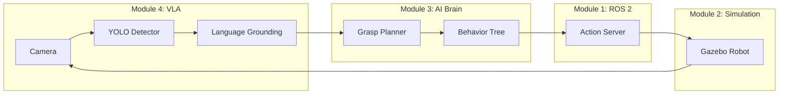

# Capstone Project: Submission Guidelines

## Overview

This guide explains **how to package and submit** your capstone project. Follow these instructions carefully to ensure all required materials are included and properly formatted.

**Submission Deadline:** End of Week 14 (specific date on course syllabus)
**Late Policy:** -10% per day late (max 3 days, then 0)

---

## Submission Checklist

Before submitting, ensure you have **all required components**:

### Required Files

- [ ] **Source Code** (ROS 2 workspace with all packages)
- [ ] **README.md** (setup and usage instructions)
- [ ] **Demo Video** (3-5 minutes, MP4 format)
- [ ] **Architecture Diagram** (node graph + data flow)
- [ ] **Reflection Report** (2-3 pages, PDF or Markdown)
- [ ] **Launch Files** (working out-of-the-box)
- [ ] **URDF/World Files** (if custom models created)

### Optional Files (for bonus points)

- [ ] Trained model weights (if applicable)
- [ ] Dataset (if you collected custom data)
- [ ] Additional documentation (API docs, design docs)

---

## Part 1: Preparing Your Workspace

### 1.1 Clean Your Workspace

Before packaging, remove build artifacts and unnecessary files:

```bash
cd ~/your_capstone_ws

# Remove build/install/log directories
rm -rf build install log

# Remove Python cache
find . -type d -name "__pycache__" -exec rm -rf {} +
find . -type f -name "*.pyc" -delete

# Remove temporary files
find . -type f -name "*~" -delete
find . -type f -name ".DS_Store" -delete
```

### 1.2 Verify Build

Ensure your workspace builds cleanly:

```bash
# Fresh build
colcon build

# Source and test
source install/setup.bash
ros2 launch your_package your_launch_file.launch.py
```

**If build fails, fix errors before submitting.**

### 1.3 Required Workspace Structure

Your workspace should follow this structure:

```
your_capstone_ws/
├── README.md                          # Main documentation
├── src/
│   ├── package1_perception/           # e.g., vision nodes
│   │   ├── package.xml
│   │   ├── setup.py
│   │   ├── launch/
│   │   ├── config/
│   │   └── scripts/ or src/
│   ├── package2_planning/             # e.g., navigation nodes
│   │   └── ...
│   └── package3_control/              # e.g., manipulation nodes
│       └── ...
├── docs/
│   ├── architecture_diagram.png       # Node graph
│   └── reflection_report.pdf          # Reflection
├── media/
│   └── demo_video.mp4                 # Demo video
├── models/                            # Optional: URDF, worlds
│   ├── urdf/
│   └── worlds/
└── weights/                           # Optional: trained models
    └── your_model.pth
```

---

## Part 2: Required Documentation

### 2.1 README.md

Your README must include:

```markdown
# [Project Title]

## Description
Brief description of what your robot does (2-3 sentences).

## Team Members
- Your Name (Student ID)

## Dependencies
### System Requirements
- Ubuntu 22.04
- ROS 2 Humble
- Gazebo Fortress (or Isaac Sim X.X.X)
- Python 3.10+

### ROS 2 Packages
```bash
sudo apt install ros-humble-navigation2 ros-humble-vision-msgs ...
```

### Python Packages
```bash
pip3 install ultralytics torch opencv-python clip ...
```

## Build Instructions
```bash
cd ~/your_capstone_ws
colcon build --symlink-install
source install/setup.bash
```

## Launch Instructions
```bash
# Terminal 1: Start Gazebo simulation
ros2 launch your_package simulation.launch.py

# Terminal 2: Start VLA pipeline
ros2 launch your_package vla_system.launch.py

# Terminal 3: Send command
ros2 topic pub /command std_msgs/msg/String "data: 'pick up the red cube'"
```

## Usage Examples
- "pick up the red cube" - Robot grasps red cube
- "navigate to the table" - Robot moves to table location
- "sort the blocks by color" - Robot sorts colored blocks into bins

## Module Integration
- **Module 1 (ROS 2):** Custom action servers for task execution, topics for sensor data
- **Module 2 (Simulation):** Gazebo world with kitchen environment, URDF humanoid with camera
- **Module 3 (AI Brain):** Nav2 for navigation, behavior tree for task orchestration
- **Module 4 (VLA):** YOLO for object detection, CLIP for language grounding

## Known Issues
- Grasp success rate ~85% (sometimes object slips)
- Navigation occasionally gets stuck in narrow corridors (needs tuning)
- Works best with good lighting (sensitivity to shadows)

## Demo Video
[Link to YouTube video](https://youtube.com/...)

## Architecture
See `docs/architecture_diagram.png` for system overview.
```

---

### 2.2 Architecture Diagram

**Requirements:**
- Shows ROS 2 nodes (boxes)
- Shows topics/services/actions (arrows with labels)
- Indicates which module each node belongs to (color-coded or labeled)

**Tools to create diagram:**
- **Mermaid** (Markdown-based, renders on GitHub)
- **draw.io** (free, web-based)
- **Lucidchart** (online diagram tool)
- **Hand-drawn** (scan or photo, must be legible)

**Example Mermaid diagram:**

```markdown

```

**Save as:** `docs/architecture_diagram.png` or `docs/architecture_diagram.md`

---

### 2.3 Reflection Report

**Format:** PDF or Markdown (2-3 pages)

**Required Sections:**

**1. Technical Challenges (1 page)**
- Describe **3 significant challenges** you faced
- Explain **how you solved** each challenge
- Include code snippets or diagrams if helpful

**Example:**
> **Challenge 1: YOLO missed small objects**
>
> Problem: YOLO v8n failed to detect objects smaller than 50 pixels in bounding box.
>
> Solution: Switched to YOLOv8m (medium model) which has better small object detection. Trade-off: inference time increased from 15ms to 45ms, but still acceptable for our 10 Hz control loop.
>
> Code: Changed model loading from `YOLO('yolov8n.pt')` to `YOLO('yolov8m.pt')` in detector node.

**2. Design Decisions (1 page)**
- Why did you choose approach X over approach Y?
- Trade-offs you considered (e.g., A* vs RRT, behavior tree vs state machine)

**Example:**
> **Decision: Behavior Tree vs. Finite State Machine**
>
> We chose behavior trees over FSMs because our task (sort objects by color) required hierarchical decomposition: outer loop iterates over detected objects, inner sequence performs grasp-place for each object. Behavior trees made this structure explicit, whereas FSMs would require complex state explosion (Idle → Detect → ForEachObject → Grasp1 → Place1 → Grasp2 → ...).

**3. Future Improvements (0.5 page)**
- What would you add with more time?
- Technical debt or shortcuts you took
- Next features to implement

**4. Lessons Learned (0.5 page)**
- What did you learn about robotics integration?
- What surprised you?
- Advice for future students

---

### 2.4 Demo Video

**Requirements:**
- **Length:** 3-5 minutes (strict limit)
- **Format:** MP4, H.264 codec
- **Resolution:** 1080p (1920×1080) or 720p minimum
- **Audio:** Narration OR text overlays explaining what's happening

**Required Content:**
1. **Introduction** (30 sec)
   - Project title
   - Brief description of task
   - Team member name(s)

2. **System Overview** (30 sec)
   - Show Gazebo environment
   - Show RViz2 with visualizations
   - Briefly explain architecture

3. **Success Case** (90-120 sec)
   - Demonstrate end-to-end task completion
   - Show all 4 modules in action:
     - Module 1: ROS 2 topics updating
     - Module 2: Robot moving in Gazebo
     - Module 3: Planned path in RViz2
     - Module 4: Object detections visualized
   - Narrate what's happening at each step

4. **Failure Case & Recovery** (60 sec)
   - Show a failure scenario (object not found, path blocked, grasp failed)
   - Demonstrate error handling and recovery
   - This proves your system is robust

5. **Conclusion** (30 sec)
   - Summary of achievements
   - Key technical highlights

**Tips:**
- **Use split-screen:** Gazebo on left, RViz2 on right (OBS Studio can do this)
- **Add text overlays:** Label each module as it appears
- **Show terminal output:** Helps explain what's happening
- **Practice before recording:** Do a dry run to ensure smooth demo

**Recording Tools:**
- **OBS Studio** (free, powerful screen recording)
- **SimpleScreenRecorder** (Linux, lightweight)
- **QuickTime** (macOS built-in)
- **Kazam** (Ubuntu, simple UI)

**Upload Location:**
- YouTube (unlisted or public)
- Google Drive (make link shareable)
- Vimeo
- Include link in README.md

---

## Part 3: Packaging Your Submission

### 3.1 Create Submission Archive

**Option A: Git Repository (Recommended)**

```bash
cd ~/your_capstone_ws

# Initialize git if not already
git init

# Add all source files
git add src/ docs/ media/ README.md

# Commit
git commit -m "Capstone project submission"

# Push to GitHub (or GitLab)
git remote add origin https://github.com/your-username/capstone-robotics.git
git push -u origin main
```

**Submit:** GitHub repository URL

**Option B: ZIP Archive**

```bash
cd ~

# Create archive (exclude build artifacts)
tar -czf capstone_yourname.tar.gz \
    --exclude='build' \
    --exclude='install' \
    --exclude='log' \
    --exclude='__pycache__' \
    your_capstone_ws/

# Verify archive size (<500 MB)
ls -lh capstone_yourname.tar.gz
```

**Submit:** Upload ZIP/TAR file to course submission portal

---

### 3.2 Submission Portal

**Required Information:**

1. **Student Details**
   - Full Name
   - Student ID
   - Email

2. **Project Information**
   - Project Title
   - Chosen Scenario (or "Custom")
   - Estimated hours spent

3. **Links**
   - GitHub repository OR uploaded archive
   - Demo video URL
   - Any external resources used

4. **Self-Assessment**
   - Estimated grade (A/B/C/D/F)
   - Modules you believe are fully integrated (check all that apply)
   - Known issues or incomplete features

---

## Part 4: Verification Before Submission

### 4.1 Build Test on Fresh System

**Simulate grader environment:**

```bash
# Create new workspace directory
mkdir -p ~/test_capstone_ws
cd ~/test_capstone_ws

# Extract your submission
tar -xzf ~/Downloads/capstone_yourname.tar.gz

# Follow your own README to build
cd your_capstone_ws
colcon build

# Does it work?
source install/setup.bash
ros2 launch ...
```

**If build fails following your README, fix the README or code.**

---

### 4.2 Checklist Review

Print this checklist and verify each item:

**Source Code:**
- [ ] All packages build without errors
- [ ] No hardcoded paths (use `ament_index_python` for package paths)
- [ ] Launch files work out-of-the-box
- [ ] No "TODO" or placeholder code in critical sections

**Documentation:**
- [ ] README has all required sections
- [ ] Architecture diagram shows node graph
- [ ] Reflection report is 2-3 pages
- [ ] All files referenced in README actually exist

**Demo Video:**
- [ ] Video is 3-5 minutes (not 10+ minutes)
- [ ] Shows all 4 modules clearly
- [ ] Includes failure case + recovery
- [ ] Uploaded and link works

**Integration:**
- [ ] Can identify specific code where each module contributes
- [ ] Modules communicate via ROS 2 (not external scripts)
- [ ] End-to-end task completes successfully

**Bonus (if claiming):**
- [ ] Evidence of bonus work included (trained model weights, hardware photos)
- [ ] Bonus documented in README under "Bonus Features" section

---

## Part 5: Common Submission Errors

### Error 1: "Code doesn't build"

**Problem:** Missing dependencies not listed in README

**Fix:** Test build on clean machine OR provide complete dependency list

---

### Error 2: "Demo video is 15 minutes"

**Problem:** Video too long, grader won't watch entire thing

**Fix:** Edit to 3-5 minutes, remove unnecessary parts

---

### Error 3: "Hardcoded file paths"

**Problem:** Code references `/home/yourname/workspace/...`

**Fix:** Use relative paths or `ament_index_python.packages.get_package_share_directory()`

```python
# BAD
world_path = "/home/alice/capstone_ws/src/my_pkg/worlds/kitchen.world"

# GOOD
from ament_index_python.packages import get_package_share_directory
world_path = os.path.join(get_package_share_directory('my_pkg'), 'worlds', 'kitchen.world')
```

---

### Error 4: "Missing reflection report"

**Problem:** Submitted code but no reflection PDF/Markdown

**Fix:** Include `docs/reflection_report.pdf` in submission

---

### Error 5: "Can't reproduce results"

**Problem:** Launch file crashes, no error handling

**Fix:** Test on fresh system, add error messages, document known issues

---

## Part 6: Resubmission Policy

**If you discover an error after submission:**

- Email instructor within 24 hours
- Provide specific description of issue
- Submit corrected version

**Penalties:**
- **Minor fix** (typo in README, broken video link): No penalty if fixed within 24 hours
- **Major fix** (code doesn't build, missing module): -10% penalty, must resubmit within 48 hours
- **Late submission:** -10% per day, max 3 days

---

## Part 7: Academic Integrity

### Allowed

- Using course code examples and exercises as starting points
- Using open-source ROS 2 packages (Nav2, MoveIt2, etc.)
- Using pretrained models (YOLO, CLIP, etc.)
- Discussing design approaches with classmates

### Not Allowed

- Copying another student's code without attribution
- Using paid services to complete project
- Submitting work completed by someone else
- Plagiarizing documentation from other sources

**If using external code:**
- Cite source in README
- Explain your modifications
- Only use as small components, not entire system

---

## Part 8: Submission Confirmation

After submission, you should receive:

1. **Automated Confirmation Email** (within 5 minutes)
   - Contains your submission timestamp
   - Lists files received

2. **Preliminary Feedback** (within 3 days)
   - Basic checks: code builds, video plays, README present
   - Flags any major issues for quick fix

3. **Final Grade** (within 2 weeks)
   - Detailed rubric with point breakdown
   - Comments on each evaluation category

**If you don't receive confirmation email, contact instructor immediately.**

---

## Frequently Asked Questions

**Q: Can I submit early?**
A: Yes! Early submissions receive priority grading and can get feedback for revision.

**Q: What if my code works on my machine but not grader's?**
A: This is why we require complete build instructions and dependency list. Test on fresh VM if possible.

**Q: Do I need to submit trained model weights?**
A: Only if you trained custom models. Pretrained models (YOLO, CLIP) don't need to be included.

**Q: Can I use code from my previous module exercises?**
A: Yes, absolutely! The capstone integrates previous exercises.

**Q: What if my video is 5 minutes 30 seconds?**
A: 30 seconds over is fine. But 10+ minutes is too long.

**Q: I'm working in a team of 2. Do we submit separately?**
A: No, submit one project with both names. Both team members receive same grade.

---

## Final Checklist

Before clicking "Submit":

- [ ] I have tested my code on a clean workspace
- [ ] My README allows someone to build and run my project
- [ ] My demo video is 3-5 minutes and shows all modules
- [ ] My reflection report discusses challenges and design decisions
- [ ] All required files are included
- [ ] I have verified my submission archive/repository
- [ ] I understand the grading rubric
- [ ] I certify this is my own work (or properly attributed)

**Once submitted, you cannot change files. Double-check everything!**

---

**Good luck with your submission! You've built an impressive integrated robotics system.**
